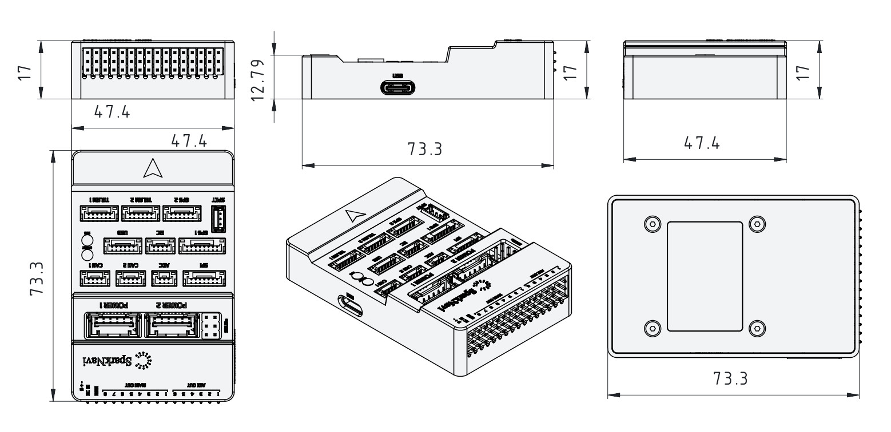

# SparkNavi Blue

SparkNavi Blue is a high-performance STM32H743 flight control computer designed for professional UAV, robotics, and research platforms.

Fully supported by the ArduPilot ecosystem and engineered for long-lifecycle deployment across industrial and research applications.

Widely deployed across industrial, research, and autonomous platform integrations.

---

## Key Features

- CNC machined aluminum enclosure  
- STM32H743 MCU (480MHz)  
- 2MB Flash  
- Dual IMU (ICM42652 + ICM42688)  
- External I2C compass support (RM3100 / IST8310)  
- CAN FD (2 ports)  
- Dual GPS ports  
- microSD logging  
- Dedicated IOMCU  
- Integrated RGB status LED  
- USB Type-C  
- Compact enclosed design  

---

## Manufacturing & Compliance

Designed and manufactured in Taiwan.

The hardware is built using globally sourced industrial-grade components suitable for customers with strict regulatory, compliance, or export requirements.

### Regulatory Compliance

SparkNavi Blue has passed international EMC and safety compliance testing.

#### FCC (United States)

- 47 CFR FCC Part 15 Subpart B (Class B)
- ANSI C63.4:2014

#### CE (European Union)

- EN 55032:2015 + A11:2020
- EN 55035:2017 + A11:2020
- EN IEC 61000-3-2:2019 + A2:2024
- EN 61000-3-3:2013 + A2:2021 + AC:2022

#### PSE (Japan)

- J62368-1:2023

These certifications enable deployment across North America, Europe, and Japan.

---

## Size

---

## Specifications

| Item | Specification |
|---|---|
| MCU | STM32H743 (480MHz) |
| IOMCU | STM32F103 |
| Flash | 2MB |
| IMU | ICM42652 + ICM42688 |
| Barometer | BMP280 |
| Internal Compass | HMC5883L |
| CAN | 2× CAN FD |
| UARTs | 6 |
| PWM Outputs | 14 (6 AUX + 8 MAIN via IOMCU) |
| Logging | microSD |
| USB | USB-C |

---

## Main Connectors

- POWER1 / POWER2  
- GPS1 / GPS2  
- TELEM1 / TELEM2  
- CAN1 / CAN2  
- SPI expansion  
- ADC expansion  
- I2C external bus  
- SBUS / RSSI port  

---

## UART Mapping

| Port | Function |
|---|---|
| USART1 | GPS1 |
| UART4 | GPS2 |
| USART2 | TELEM1 |
| USART3 | TELEM2 |
| UART7 | Debug |
| UART8 | IOMCU |

---

## I2C Buses

| Bus | Usage |
|---|---|
| I2C2 | External I2C |
| I2C4 | Internal sensors |

External compasses are automatically detected on the external I2C bus.

---

## Connector Overview

---

## Connector Pin Definitions

### TELEM1 / TELEM2 (Telemetry UART)

| Pin | Signal | Direction | Description |
|---|---|---|---|
| 1 | +5V | Output | 5V peripheral power |
| 2 | TX | Output | UART transmit |
| 3 | RX | Input | UART receive |
| 4 | CTS | Input | Flow control (optional) |
| 5 | RTS | Output | Flow control (optional) |
| 6 | GND | — | Ground |

---

### GPS1

| Pin | Signal | Direction | Description |
|---|---|---|---|
| 1 | +5V | Output | 5V peripheral power |
| 2 | GPS1_TX | Output | UART TX to GPS |
| 3 | GPS1_RX | Input | UART RX from GPS |
| 4 | I2C2_SCL | Output | Compass I2C clock |
| 5 | I2C2_SDA | Bi-Dir | Compass I2C data |
| 6 | SAFETY_SWITCH | Input | Safety button |
| 7 | SAFETY_SWITCH_LED | Output | Safety switch / LED |
| 8 | GND | — | Ground |

---

### GPS2

| Pin | Signal | Direction | Description |
|---|---|---|---|
| 1 | +5V | Output | 5V peripheral power |
| 2 | GPS2_TX | Output | UART TX to GPS |
| 3 | GPS2_RX | Input | UART RX from GPS |
| 4 | I2C2_SCL | Output | Secondary I2C clock |
| 5 | I2C2_SDA | Bi-Dir | Secondary I2C data |
| 6 | GND | — | Ground |

---

### CAN1 / CAN2

| Pin | Signal | Direction | Description |
|---|---|---|---|
| 1 | +5V | Output | 5V peripheral power |
| 2 | CAN_H | Bi-Dir | CAN high |
| 3 | CAN_L | Bi-Dir | CAN low |
| 4 | GND | — | Ground |

---

### USB Port

| Pin | Signal | Direction | Description |
|---|---|---|---|
| 1 | +5V | Output | 5V peripheral power |
| 2 | USB_D+ | Bi-Dir | USB data positive |
| 3 | USB_D- | Bi-Dir | USB data negative |
| 4 | GND | — | Ground |
| 5 | Buzzer | Output | External buzzer output |
| 6 | x | — | x |

This USB port allows connection of an external safety buzzer and USB interface for firmware upload and MAVLink communication.

---

### I2C External Port

| Pin | Signal | Direction | Description |
|---|---|---|---|
| 1 | +5V | Output | 5V peripheral power |
| 2 | I2C2_SCL | Output | I2C clock |
| 3 | I2C2_SDA | Bi-Dir | I2C data |
| 4 | GND | — | Ground |

---

### ADC Port

| Pin | Signal | Direction | Description |
|---|---|---|---|
| 1 | +5V | Output | 5V peripheral power |
| 2 | ADC | Input | Analog input |
| 3 | GND | — | Ground |

---

### SPI Expansion Port

| Pin | Signal | Direction | Description |
|---|---|---|---|
| 1 | +5V | Output | 5V peripheral power |
| 2 | SPI6_SCK | Output | SPI clock |
| 3 | SPI6_MISO | Input | SPI MISO |
| 4 | SPI6_MOSI | Output | SPI MOSI |
| 5 | SPI6_CS | Output | Chip select |
| 6 | x | — | x |
| 7 | GND | — | Ground |

---

### SBUS / RSSI Port (SPKT)

| Pin | Signal |
|---|---|
| 1 | +3.3V |
| 2 | GND |
| 3 | SBUS_OUT / RSSI_IN |

---

### POWER1 / POWER2

| Pin | Signal |
|---|---|
| 1 | +5.3V (IN) |
| 2 | +5.3V (IN) |
| 3 | BAT1_I |
| 4 | BAT1_V |
| 5 | GND |
| 6 | GND |

---

### Output Architecture

SparkNavi Blue uses a dual-processor architecture:

- **MAIN outputs** are driven by the IOMCU (failsafe capable)
- **AUX outputs** are driven directly by the FMU (high-speed / flexible)

This architecture provides redundancy and improved flight safety.

---

### MAIN Outputs (IOMCU Controlled)

Primary motor outputs with hardware failsafe support.

| Output | Function | Notes |
|---|---|---|
| MAIN OUT 1 | Motor / Servo | IOMCU controlled |
| MAIN OUT 2 | Motor / Servo | IOMCU controlled |
| MAIN OUT 3 | Motor / Servo | IOMCU controlled |
| MAIN OUT 4 | Motor / Servo | IOMCU controlled |
| MAIN OUT 5 | Motor / Servo | IOMCU controlled |
| MAIN OUT 6 | Motor / Servo | IOMCU controlled |
| MAIN OUT 7 | Motor / Servo | IOMCU controlled |
| MAIN OUT 8 | Motor / Servo | IOMCU controlled |

✔ Hardware failsafe supported  
✔ Recommended for motors / critical actuators

---

### AUX Outputs (FMU Controlled)

Flexible outputs for payloads and advanced peripherals.

| Output | Typical Use |
|---|---|
| AUX OUT 1 | Gimbal / Payload |
| AUX OUT 2 | Gimbal / Payload |
| AUX OUT 3 | Landing gear |
| AUX OUT 4 | Camera trigger |
| AUX OUT 5 | Lights / Buzzer |
| AUX OUT 6 | Custom peripherals |

✔ High update rate supported  
✔ Fully configurable in ArduPilot

---

## PWM Summary

MAIN outputs are driven by the IOMCU.  
AUX outputs are driven by the FMU.

| Outputs | Pins |
|---|---|
| MAIN OUT | 1–8 |
| AUX OUT | 1–6 |
| **Total** | **14 PWM Outputs** |

---

## RC Input

The SBUS connector supports:

- SBUS input  
- SBUS output  
- RSSI input  

---

## Powering the Board

The controller can be powered from either **POWER1** or **POWER2**.

Both provide:

- Power input  
- Voltage/current sensing  
- Redundant supply capability  

---

## Compass

External compasses are recommended for optimal flight performance.

Supported models:

- RM3100  
- IST8310  

Automatic compass rotation detection is enabled.

---

## Firmware Support

Fully supported in the official ArduPilot firmware distribution.

Board Name: **SparkNavi Blue**  
APJ Board ID: **1362**

### Supported Firmware

- ArduPilot (Official Support)

---

## Typical Wiring

Typical wiring includes:

- GPS on GPS1  
- Telemetry radio on TELEM1  
- External compass on I2C  
- ESCs on MAIN outputs  

---

## Typical Applications

- Industrial UAV platforms
- VTOL and multirotor systems
- Autonomous robotics
- Research and development platforms

---

## Electrical Specifications

| Parameter | Value |
|---|---|
| Operating Voltage | 4.8V – 6.0V |
| Recommended Power Module | 5.3V regulated supply |
| Typical Power Consumption | 0.98W |
| Logic Level | 3.3V |
| GPS Power Output | 5V |
| Peripheral Power Output | 5V |

Power is supplied via POWER1 or POWER2 modules with redundant capability.

Power consumption may vary depending on connected peripherals.

---

## Environmental

| Parameter | Value |
|---|---|
| Operating Temperature | -20°C to +70°C |
| Storage Temperature | -40°C to +85°C |

---

## Mechanical Specifications

| Parameter | Value |
|---|---|
| Length | 73.3 mm |
| Width | 47.4 mm |
| Height | 17 mm |
| Weight | 70 g |

---

## Manufacturer

**SparkNavi**  
Designed & Manufactured in Taiwan
